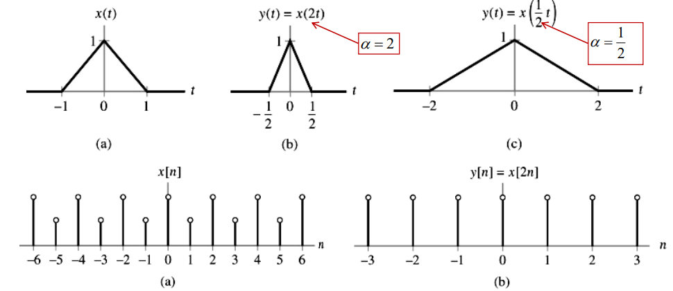
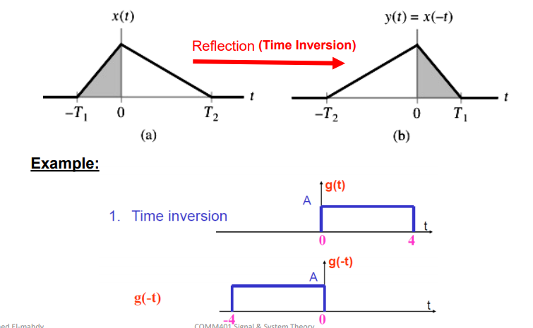
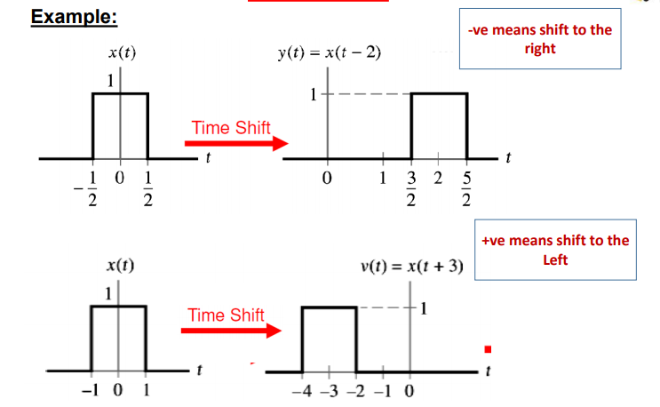
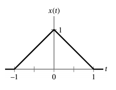
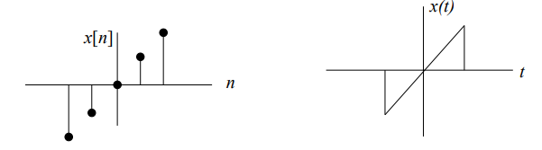
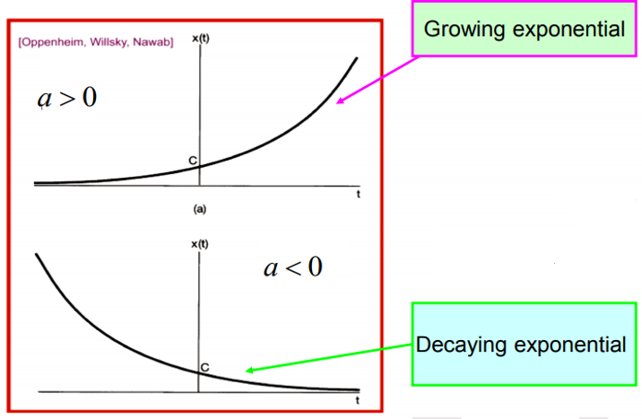
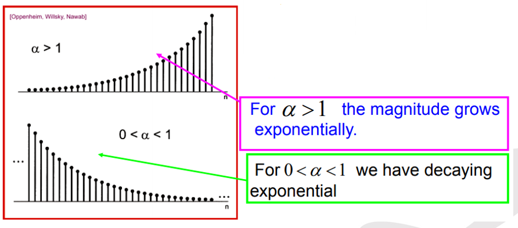

# What is a Signal ?
A signal is a function representing a
physical quantity.

Mathematically, signals are represented as functions of
one or more independent variables.

# Classification of Signals
## In terms of Continuity
Mathematically, a signal is represented as a function of time $x(t)$
### Continuous-Time Signals (CT)
- The independent variable $t$ is continuous.
- The signal values are defined for all $t$ in the interval of interest.
- It's denoted as $x(t)$.
- **Example:** volt or current.

### Discrete Time Signal (DT)
- The independent variable $t$ is discrete.
- It takes only a discrete values $n$ where $n$ is an integer.
- It's denoted as $x(nTs)$ or $x(n)$, Ts
is the sampling time.
- It results from sampling of (CT) signal.

#### Applications of Discrete Time Signals
Discrete time signals are used to convert the analog signal to digital data using
the following operations:

1) **Sampling**: Convert the message signal to samples (by multiplying by impulses).
2) **Quantization**: Converting of samples to a set of discrete amplitudes.
3) **Binary encoding**: Translating the discrete set of samples into digital data. 

## Classification of Signals (Type of Number)
- **Real Signals**: $x(t)$ is a real signal if its value is a real number!
- **Complex Signals**: $x(t)$ is a complex signal if its value is a complex number

## Classifications of Signals (Randomness)
- **Deterministic Signals**: Whose values are completely specified for any given time.
- **Random Signals**: Take random values at any given time and must be characterized statistically.

## Classifications of Signals (Periodicity)
- **Periodic Signals**: It's signals that repeats a specific period.
- **Non-Periodic Signals**: It's signals that don't repeat.

# Power and energy of a signal
## Energy
Power is the energy per unit time so if you integrate instant power **squared** over all time, it gives total energy!
- For CT Signals: $$E_\infty = \int_{-\infty}^{\infty} \left| x(t) \right|^2 dt$$
- For DT Signals: $$E_\infty = \sum_{-\infty}^{\infty} \left| x[n] \right|^2 dt$$

In order to know the actual physical energy of a signal, one must multiply it by a constant factor. For example if $x(t)$ is a current signal, you must multiply it by $Z$, the impedence of the circuit in order to determine the Energy. $E = ZI^2$

## Power
Power is defined as the amount of energy consumed per unit time. This quantity is useful if the energy of the signal goes to infinity or the signal is "not-squarely-summable". 

- In continuous domain: $$P_\infty = lim_{T\rightarrow \infty} \frac{1}{2T} \int_{-T}^{T} \left| x(t) \right|^2 dt$$
- In discrete domain: $$P_\infty = lim_{N\rightarrow \infty} \frac{1}{2N+1} \sum_{-N}^{N} \left| x[n] \right|^2$$
- For periodic signals: $$P = \frac{1}{T_0} \int_{\frac{-T_0}{2}}^{\frac{T_0}{2}} \left| x_p(t) \right|^2 dt$$

> **NOTES**: 
> - A finite energy signal will have zero **TOTAL** power.
> - Signals whose power is finite and non-zero, the energy will be infinite. For example sinusoidal signals have finite, non-zero power but infinite energy.
> - A signal cannot be both an energy signal and a power signal at the same time.
> - A signal can neither be an energy signal nor a power signal. In other words, both can be infinite.

# Transformations
## Time Scaling
$$ x(t) \rightarrow x(at), a \in R $$
$$ x(n) \rightarrow x(an), a \in Z $$

You divide the elements on the $x$ axis *(AKA time)* time axis by $a$. In case of discrete time, only integer value points are used.   

## Time Inversion (Reflection)
  

## Time Shift
  

### General View
$x(t \plusmn t_0)$ for $t_0 > 0$
- It gives left shift if $t_0$ is **positive**.
- It gives right shift if $t_0$ is **negative**.

> **IMPORTANT:** When doing both time shift and time scaling. Time Shift MUST be done first BEFORE time scaling.

# Even and odd signals
## Even Signals
They're symmetric around y-axis.

$$ x(t) = x(-t) ,\; x(n) = x(-n) $$
  

## Odd Signals
They're symmetric around the origin.

$$ x(t) = -x(-t), \; x(n) = -x(n)$$
  

> Odd signals must have zero value at the origin!

## Signal Decomposition
Any signal can be decomposed into an even and odd part.

$$ x(t) = Ev\left\{ x(t) \right\} + Od\left\{ x(t) \right\} $$
$$ Ev\left\{ x(t) \right\} = \frac{1}{2} \left( x(t) + x(-t) \right) $$
$$ Od\left\{ x(t) \right\} = \frac{1}{2} \left( x(t) - x(-t) \right) $$

> The same formulas apply to Discrete functions replacing $t$ with $n$.

# Real Exponential Signal
## Continuous Signal 
$$x(t) = Ce^{at}$$
Where $C$ and $a$ are real! 

  

## Discrete 
$$ x(n) = Ce^{an} $$

  