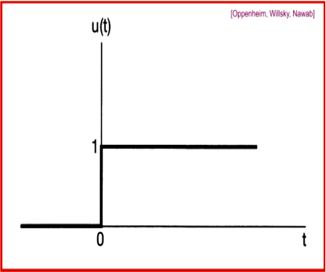
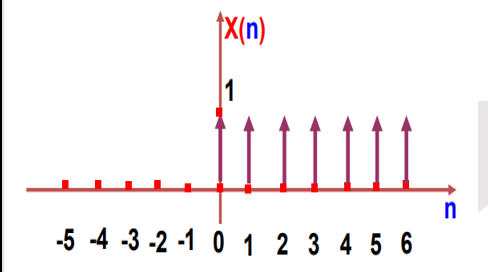
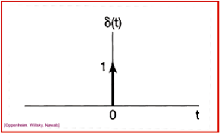
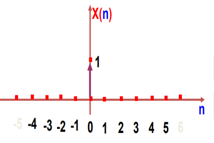

# Complex Exponential Signal
Given the signal $x(t) = e^{j\omega_0 t}$. An important property is that it's periodic so we know that $x(t)$ is periodic with period $T$ if $x(t) = x(t+T)$ then
$$e^{j\omega_0 t} = e^{j\omega_0 (t+T)} = e^{j\omega_0 t} \, e^{j\omega_0 T}$$
For periodicity, we must have that $e^{j\omega_0 T} = 1$

Excluding the trivial solution then the fundamental period $T_0$ of $x(t)$ is the smallest value of $T$ for which $e^{j\omega_0 T} = 1$ holds.

$$ T_0 = \frac{2\pi}{|\omega_0|} $$
> Notice the absolute, thus $e^{j\omega_0 t}$ has the same fundamental period as $e^{-j\omega_0 t}$

- A solution is : 
  
$$ e^{j\omega t} = cos(\omega t) + jsin(\omega t)$$ 

# Periodicity
Notice that the fundamental period is inversely propotional to $\omega_0$.

## Periodicity in Discrete Time
According to the defination of periodicity for period $N > 0$, $e^{j\omega_0 N} = 1$

This condition can be fulfilled if there exists such an integer number $m$ that $w_o m = 2\pi m$

Thus, $\frac{\omega_0}{2\pi} = \frac{m}{N}$ where $\frac{m}{N}$ **must be a rational number**!

The fundamental period of such signal is $m\, \frac{2\pi}{\omega_0}$

> This is valid also for sinusoidal signals.

If we increase the angular frequency $\omega_0$ by $2\pi$, then we have: 
    
$$ e^{j(\omega_0 + 2\pi)n} = e^{j\omega_0 n} e^{j2\pi n} = e^{j\omega_0 n}$$

Because $e^{j2\pi n} = 1$ for any **integer** value of $n$!

> This is different then cont. time case where $t$ can have fractions and thus $e^{j2\pi n}$ is not always 1!

> Continuous time signals are periodic for any values of $\omega_0$.

## Notes in Periodicity
- Periodic $\plusmn$ Non-Periodic = Non-Periodic
- Periodic $\times$ Non-Periodic = Non-Periodic
- Periodic $\plusmn$ Periodic = 
  - **For DT Signals**: Periodic
  - **For CT Signals**: Periodic IF $\frac{T_{01}}{T_{02}}$ or $\frac{\omega_{01}}{\omega_{02}}$ is rational number. The total period is the LCM of both periods.

# Unit Step Functins
## Continuous Time
$$
\begin{aligned}
    u(t)=
    \begin{cases}
      0, & t < 0 \\
      1, & t > 0
    \end{cases}
\end{aligned}
$$

> Notice that the unit step function is discontinuous at $t = 0$!

  

## Discrete Time
$$
\begin{aligned}
    U(t)=
    \begin{cases}
      1, & n \ge 0 \\
      0, & <> > 0
    \end{cases}
\end{aligned}
$$
  

# Unit Impulse Function
## Continuous Time
$$
\begin{aligned}
    \delta(t)=
    \begin{cases}
      1, & t = 0 \\
      0, & t \not ={0}
    \end{cases}
\end{aligned}
$$

$t$ is a real value!

  

## Discrete Time
$$
\begin{aligned}
    \delta(n)=
    \begin{cases}
      1, & n = 0 \\
      0, & n \not ={0}
    \end{cases}
\end{aligned}
$$

$n$ is only integer values!

  

# Relationship between Unit Impluse and Unit Step

## In discrete time
The DT unit impluse is the first difference of the discrete time step.

$$ \delta [n] = u[n] - u[n-1]$$

Conversely, the DT unit step is the sum of the unit sample!

$$ u[n] = \sum_{m=-\infty}^n \delta [m]$$

## In continuous time
It's related in a manner similar to discrete time where: 

$$ u(t) = \int_{-\infty}^t \delta(T) dT$$
$$ \delta (t) = \frac{du(t)}{dt} $$

>   Remember: $u(t)$ is not differentiable in the conventional sense because of discontinuity at $t = 0$.

