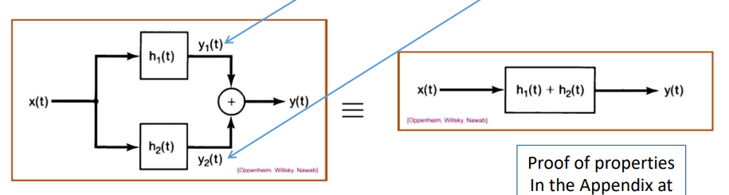
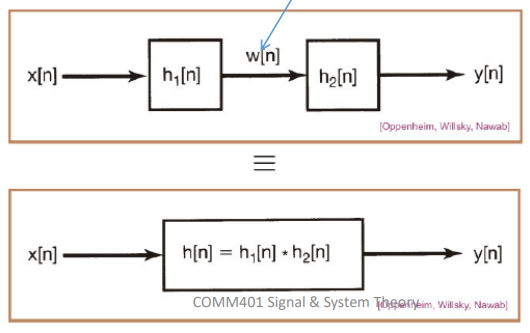

# Discrete Convolution

## Steps to Solve
1. Rename $x[n] \rightarrow x[k]$ and $h[n] \rightarrow h[k]$ then draw both.
2. Shift $h[k]$ by positive $n$ to the left to get $h[n+k]$ **_OR_** shift $x[k]$ by positive n to the left to get $x[n+k]$ if easier.
3. Reverse $h[n+k]$ to get $h[n-k]$ **_OR_** Reverse $x[n+k]$ to get $x[n-k]$ if easier.
4. Multiply $x[k]$ & $h[n-k]$ ***OR*** $x[n-k]$ and $h[k]$ then get the summation of all the pulses to get $y[n]$!

## Relation Between unit impluse and unit step responses
It's the same as the relation between the unit impulse and unit step directly.

### In discrete time
$$ s[n] = \sum_{k=-\infty}^{\infty} h[k]$$
$$ h[n] = s[n] - s[n-1] $$

### In cont. time
$$ s(t) = \int_{-\infty}^{t} h(\tau) d\tau$$
$$ h(t) = \frac{d\ s(t)}{dt} $$

# Important Rules
- $x(t)*\delta(t) = x(t)$
- $x(t)*\delta(t-a) = x(t-a)$
- $x(t-b)*\delta(t-a) = x(t-a-b)$

# Properties of LTI Systems
## Commutative Property
$$ x(t) * h(t) = h(t) * x(t)$$

## Distributive Property
$$ x(t) * (h_1(t) + h_2(t)) = x(t)*h_1(t) + x(t)*h_2(t)$$

  

## Associative Property
$$ x(t) * (h_1(t) * h_2(t)) = (x(t) * h_1(t)) * h_2(t) $$

  

> Order in a cascade of LTI systems is irrelavent.