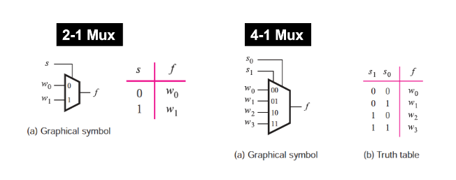
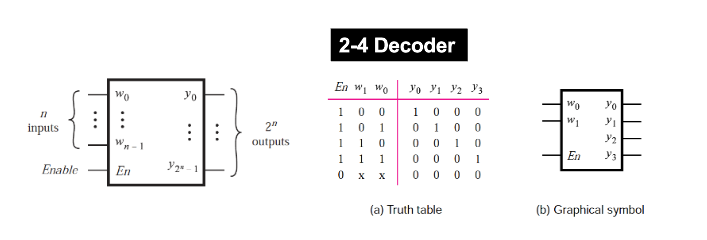
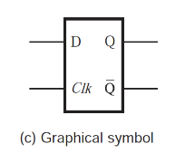
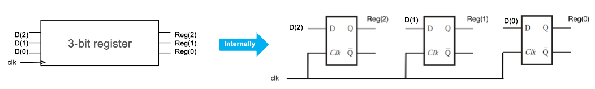
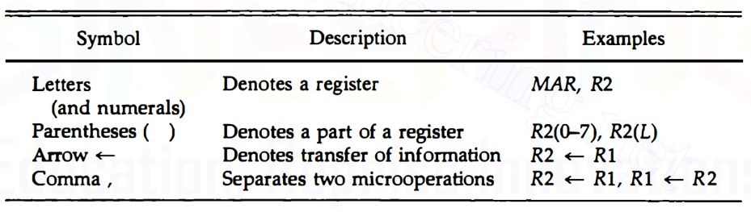
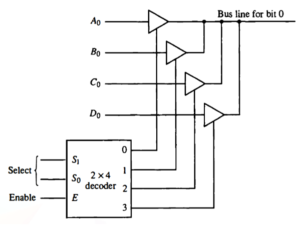

# Review

## Multiplexers
Propagates specific input to output depending on select lines. 
  

## Decoders
Decodes a number in binary to a single line of output.   

## D-Flipflop
- A D-Flipflop is a memory element that can be used to store 1 bit.
- The output Q is equal to the input D on the clock edge. 
- During the clock period, Q retains its value despite the input changing.

  

## Registers
When a set of n-flipflops are connected together to store n-bit peice of information, we refer to the set of flipflops as Registers!

A common clock is user for all the registers!
  

# Register Transfer Language
- Registers are memory INSIDE the CPU itself where we store values to do operations on them.
- There are several registers that serve other purposes: 
  - Program Counter: Holds number of next operation.
  - Instruction Register: Holds the instruction that'll be instructed next.
  - Memory Address Register: Holds the address at which we'll read or write.

### Transfer Operator
$$ R2 \leftarrow R1 $$
How about a condition ?

$$ P: R2 \leftarrow R1 $$
This means only copy R1 into R2 if and only if $P$ is true!

> Registers are able to load a new value in 1 clock cycle. This is called **parallel load capability**.

Register loading is activated on each positive (rising) clock edge.

### Important Symbols
  

## Buses
We can use Buses to control registers. Multiplexers can be used to control which register to show on the bus.

Tri-sate buffers can also be used to control access to bus: 
  

