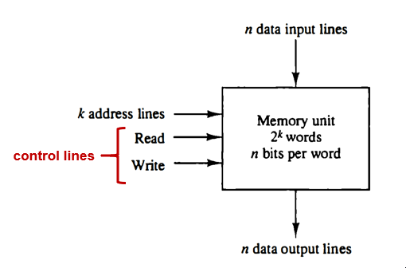
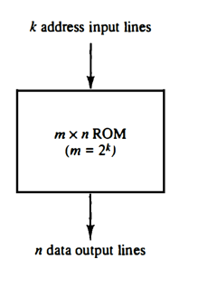
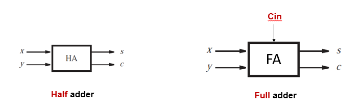
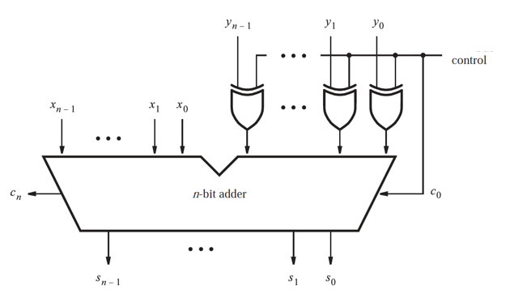

# Memory
- Stores information in form of groups of bytes called **words**.
- Data is read and written in terms of words and not single bits or bytes.
- Number of address lines is $log_2(\text{No. Of Words})$
- Number of data lines is equal to the word size.
- Maximum number of bytes = Number of bits divided by 8.

## RAM
- Main memory of computer system.
- Volatine. Data is lost when power is lost.
- Very fast and access location via address lines.

  

## ROM
- Doesn't have write capability.

  

# Arthmetic Micro-Operations

## 1-bit Adder
  

We can connect 1-bit adders together to make n-bit addition.

### Negative Numbers
In order to get the negative of a number we apply 2's complement.

$$ \bar{R} +1 $$

### Adder/Subtracter Circuit
  

If control has value of $0$, it works as adder. If control is $1$, it's a subtracter.
