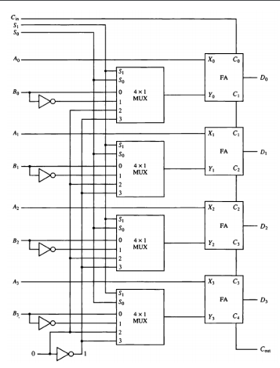

# Arithmetic Circuit
  

| $S_1$ | $S_0$ | $C_{in}$ | $Y$ | $D$ | Operation
| --- | --- | --- | --- | --- | ---
| 0 | 0 | 0 | $B$ | $A+B$ | Addition
| 0 | 0 | 1 | $B$ | $A+B+1$ | Addition with carry 1
| 0 | 1 | 0 | $B^\prime$ | $A+B^\prime$ | Subtract with borrow 1
| 0 | 1 | 1 | $B^\prime$ | $A+B^\prime + 1$ | Subtraction
| 1 | 0 | 0 | $0$ | $A$ | Transfer $A$
| 1 | 0 | 1 | $0$ | $A+1$ | Increment $A$
| 1 | 1 | 0 | $-1$ | $A-1$ | Decrement $A$
| 1 | 1 | 1 | $-1$ | $A$ | Transfer $A$

# Logic Micro-Operations
- $\bigvee$ is the OR operation.
- $\bigwedge$ is the AND operation.
- $\bigoplus$ is the XOR operation.

## Selective Set
- Uses the OR $\vee$ gate.
- $A \leftarrow A \vee B$
- Sets the bits of $A$ to true at the positions where $B$ has a one. 

## Selective Complement
- Uses the XOR $\oplus$ gate.
- $A \leftarrow A \oplus B$
- Complements the bits of $A$ where $B$ is set to one.

## Selective Clear
- $A \leftarrow A \wedge B^\prime$
- Clears bits of $A$ where $B$ is set to one.

## Mask Operation
- Same as selective clear but without reverting $B$ so it clears $A$ where $B$ is set to zero.

# Shift Micro-Operations

$$ R1 \leftarrow shl \; R1 $$
$$ R1 \leftarrow shr \; R1 $$

The register must be the same on both sides!

## Circular Shift
- Circulates the bits without losing the data.
- Abbreviated as $cil$ and $cir$

## Arithmetic Shift
- Shift left multiplies the number while shift right divides the number.
- Automatically handles the sign.
- Abbreviated as $ashr$ and $ashl$.