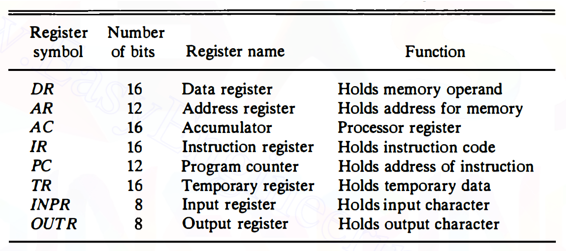
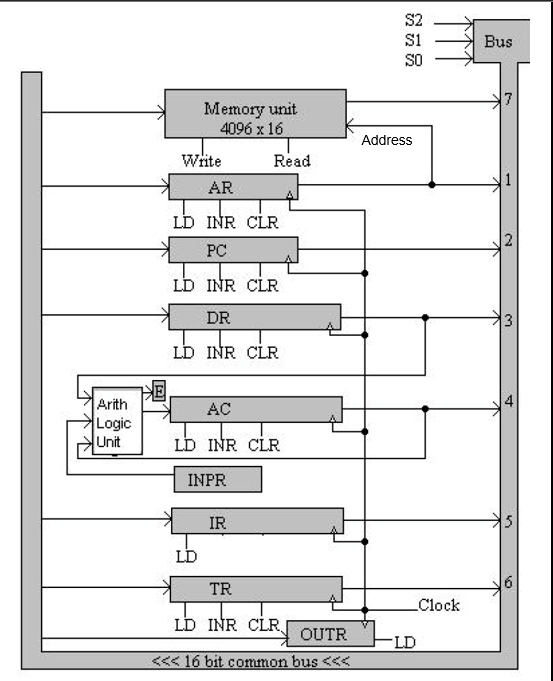

# Basic Computer

## Instruction Contents
### Opcode
Defines what the operation does. Once an instruction is read, the opcode is sent to the control unit to issue appropriate signals to perform the desired operation.

Opcodes have size $M$ which is less than the overall size of the instruction. The size $M$ depends on how many operations exists.

For any operation, a series of micro-operations need to be performed.

### Data part
The instruction must have bits specifying the source data and the destination.
- For memory, address must be provided.
- For register, the number of the register must be provided.

## Stored Program Organization
- An instruction is read from memory and moved to the register **IR** which consists of 2 parts, opcode and address.
- Data from the memory (or register) is then operated on along with the data in the register **AC** and then result is stored again in **AC** itself.
- If operation doesn't involve 2 operands, then the address field is not used. *(It may contain a number to operate on)*. This is called ***immediate operand***.
  
### Addressing Modes
The above was in direct addressing mode.

In indirect addressing, the address field of the instruction holds an address of a location which contains another address of the value.

> To differentiate between direct and indirect addressing, a bit is appended at the begining of the instruction. $0$ means direct addressing and $1$ means indirect addressing.

## Registers
  

## Basic Computer
  

- DR, AC, IR and TR are all 16 bits and the bus is 16 bits wide as well.
- PC and AR registers are 12 bits each (in order to access $2^12$ possible memory locations).
- AR regster determines which address the memory should read/write from.