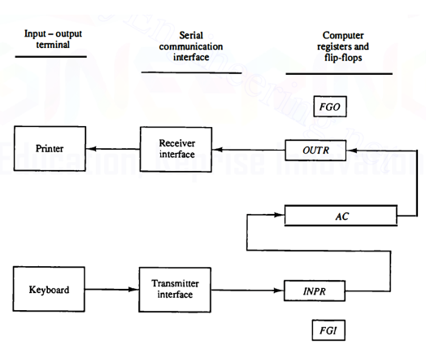

# Input / Output Process
  

## Input
User is able to input data *(8 bits in basic computer)*.
When a key is stroked on the keyboard, a transmitter sends it serially into the INPR register. 

### The FGI
It's a flipflop that determines if data is available in the INPR register. The input device never puts data into the INPR register until the computer clears INPR and sets FGI back to zero.

The data is moved from the INPR register into the AC in **parallel**.

## Output
Computer is able to output characters *(8 bits in the basic computer)*.

### The FGO
It's a flipflop that, when set to zero means that the OUTR register has data in it awaiting printing. After it's printed the flipflop is set back to one and accepts new data from the AC register.

> The FGO is kind of the opposite of the FGI.

## The instructions
I/O instructions have opcode 111 and I flipflop set to one. The control signal is $D_7IT_3$. 

We will be call it $p$ for short.

#### INP
Transfer input from INPR into the first eight bits of AC(0-7). It also clears the input flag to zero.

#### OUT
Transfer data from first eight bits of AC into OUTR and clears the output flag to zero.

#### SKI/SKO
Skip the next instruction *(AKA increment PC)* if the input/output flag is set.

# Interrupts
The problem with the above is that if there's never input or output, the computer will stay stuck in an infinite loop waiting for it and not do it's normal work.

Instead of this, when either FGO or FIO are set, the PC will intterupt the computer momentarily from what it's doing to go do the transfer and then return to where it was.

The intterupt procedurce will only work if the flipflop **IEN** is set.

## The normal instruction cycle
It's the normal cycle explained before. We just make a few additions: 
- In parallel to normal operation, it checks if **IEN** is set as well as any of the two flags is set (**FGI** or **FGO**). If true, it sets a new flipflop called **R** and the next cycle will become an interrupt cycle.

$$ T_0^\prime T_1^\prime T_2^\prime (\text{IEN}) (\text{FGI} + \text{FGO}): \ R \leftarrow 1$$

- The instructions at $T_0$ to $T_2$ are modified to only work when $R$ is set to zero.

## The interrupt cycle

$$ RT_0:\ AR \leftarrow 0,\ TR \leftarrow PC $$
$$ RT_1:\ M[AR] \leftarrow TR,\ PC \leftarrow 0 $$
$$ RT_2:\ PC \leftarrow PC + 1,\ IEN \leftarrow 0,\ R \leftarrow 0,\ SC \leftarrow 0 $$