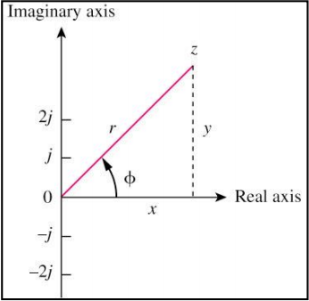
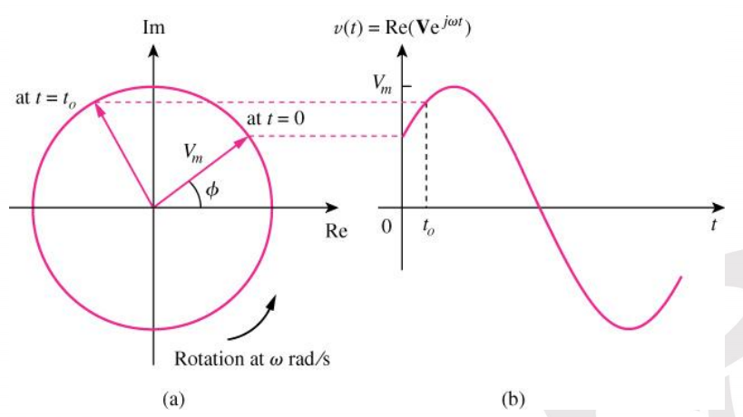

# Introduction

## Sinusoids
- A sinusoid is a signal that has the form of the sine or cosine
function.
- A general expression for the sinusoid is $v(t)=V_m sin(\omega t + \theta)$ where $\omega = 2\pi f$ and $f=\frac{1}{T}$
- Only two sinusoidal values with the same frequency can be compared by their amplitudes and phase difference.
- They're in phase if phase difference is zero and out of phase if phase diff is not zero.
- The wave with larger phase constant is called the **leading** wave.

## Phasor
- A phasor is a complex number that represents the amplitude and phase of a sinusoid.
- It can be represented in one of the following three forms: 
  - Rectangular: $z = x+yi = r\left(cos(\phi) + isin(\phi)\right)$
  - Polar: $z = r\angle\phi$
  - Exponential: $z=re^{\phi i}$
- Note that $r = \sqrt{x^2 + y^2}$ and $\phi = tan^{-1}(\frac{y}{x})$ 
    

### How to transfer from time domain to phasor domain ?

$$ v(t) = V_m \cos (\omega t + \phi) \leftrightarrow V = V_m \angle \phi $$

- Phasor **WILL ALWAYS** be defined from the **COSINE** function in all our proceeding study.
- If a voltage or current expression is in the form of a sine, it will be changed
to a cosine by subtracting from the phase.

### The differences between v(t) and V
- $v(t)$ is instantaneous or time-domain representation.
- $V$ is the frequency or phasor-domain representation.
- $v(t)$ is time dependent, V is not.
- $v(t)$ is always real with no complex term, V is generally
complex.

> **Note:** Phasor analysis applies only when frequency is constant; when it is applied to two or more sinusoid signals only if they have the same frequency. 

  

## Notes
- To convert from $cos$ to $sin$, we subtract $90^\degree$ from phase angle if $sin$ is positive, otherwise add the $90\degree$!