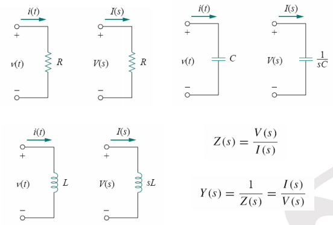

# S-Domain
The laplace transform makes problems easier because it allows us to work with algebraic equations rather than differential equations.

## Conversion of circuit
- Energy sources are converted as normal functions.
- Resistor values are kept as is.
- Inductors become $sL$ and a voltage source in series with value $Li(0)$. The voltage source can be converted into a current source with value $\frac{i(0)}{s}$.
- Capacitors become $\frac{1}{sC}$ with a current source parallel with value $Cv(0)$. The current source can be converted into a series voltage source with value $\frac{v(0)}{s}$.

### In zero-conditions
  

## Transfer functions
It's the function that relates output with input. There's multiple forms of transfer function: 
- Voltage Gain: $V_o(s)/V_i(s)$
- Current Gain: $I_o(s)/I_i(s)$
- Impedence: $V(s)/I(s)$
- Admittance: $I(s)/V(s)$

### Getting output for sinusiodal inputs
1. Replace $s$ in the transfer function with $j\omega$
2. The output will be the product of the transfer function and input.