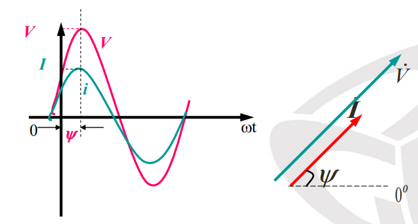
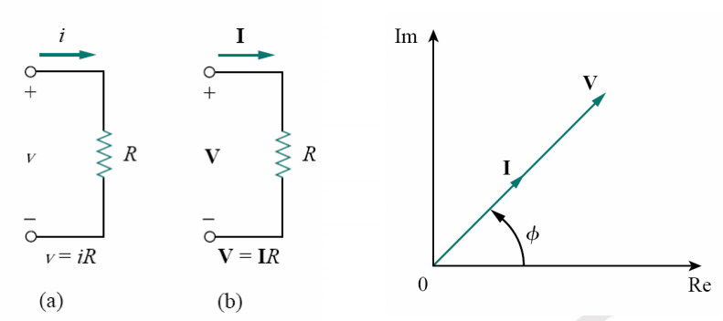
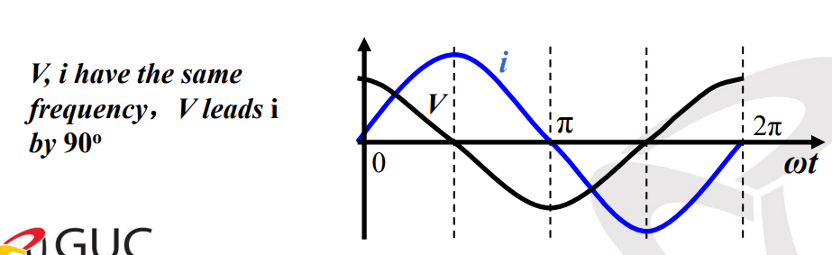
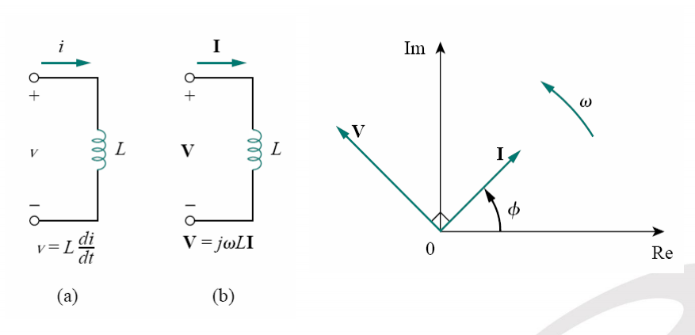
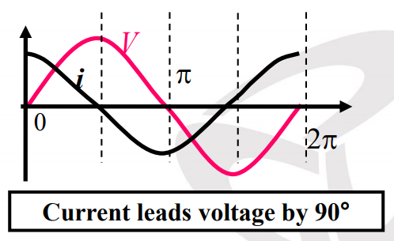
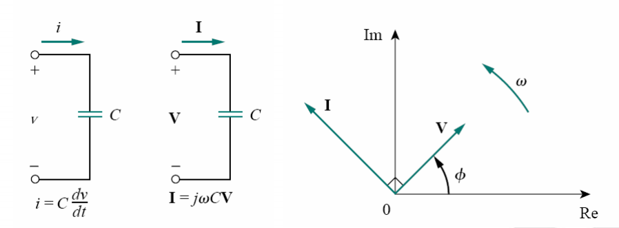

# Circuit Elements in Frequency Domain

## Resistance
$$ i = I_m cos(\omega t + \phi) $$
$$ \therefore v = iR = IR_m cos(\omega t + \phi) = V_m cos(\omega t + \phi)$$ 

  

## Inductors
$$ i_L = I_m cos(\omega t + \phi) = I_m \angle \phi $$
$$ \because V_L = L \frac{di_L}{dt}$$
$$ \therefore V_L = -L (I_m \omega sin(\omega t + \phi)) $$
Converting $-sin$ to $cos(+90)$

$$ V_L = \omega L I_m cos(\omega t + \phi + 90\degree), \; \omega L I_m = V_m $$
$$ \bold{ V_L = V_m cos(\omega t + \phi + 90\degree) = V_m \angle{\phi + 90\degree} } $$
$$ \because V_m = I_m X_L $$
$X_L$ is the **Inductive Reactance** (Resistance).

$$ \therefore X_L = \omega L = 2\pi f L$$

In vector form: 

$$ V_L = j \omega L i_L $$

  
  

## Capacitors
$$ i_C = I_m cos(\omega t + \theta) = I_m \angle \theta$$
$$ \because i_C = C \frac{dV}{dt} $$
$$ \therefore V_C = \frac{1}{C} \int i_C dt = \frac{1}{C} I_m \int cos(\omega t + \theta) dt = \frac{I_m}{\omega C} sin(\omega t + \theta)$$
$$ X_C = \frac{1}{\omega C}$$
$$ \bold{ \therefore V_C = V_m cos(\omega t + \theta - 90) = V_m \angle{\theta - 90} } $$

  
  

## Impedance
- Any combination of series and/or parallel resistors, inductors and capacitors form an impedance!
- $$ Z = R+j\omega L - \frac{j}{\omega C} $$
- A cool trick to make circuit analysis easier specially those with multiple parallel lines is to use **Admittance**! Admittance is $Y = \frac{1}{Z}$. In this case $Y_{eq} = Y_1 + Y_2 + Y_3$