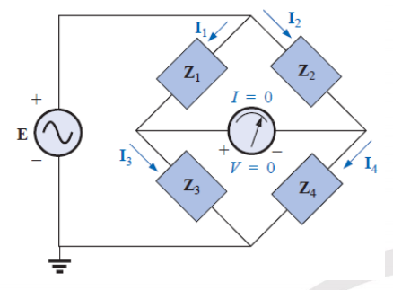

# Analysing AC Circuits
- Transform the circuit to the phasor domain.
- Solve using any appropriate circuit technique.
- Transform the results back into time domain.

# Admittance
It's the reciprocal of impedance, measured in Siemens ($S$).

$$ Y = \frac{1}{Z} = G + jB = \frac{1}{R+jX} $$

> When working with parallel elements, it's easier to think in terms of Admittance because the equivalent admittance of paralell elements is the algebric sum.

# Superposition Theorm
When a circuit has sources of multiple frequencies then the circuit must be solved with Superposition method. The total answer is the sum of time-domain responses of all the individual phasor circuits. 

# Bridge Networks

  

$$ Z_1 Z_4 = Z_2 Z_3 $$
$$ \frac{Z_1}{Z_3} = \frac{Z_2}{Z_4} $$