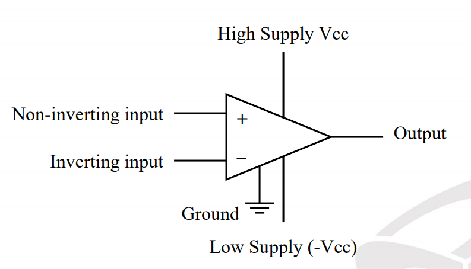
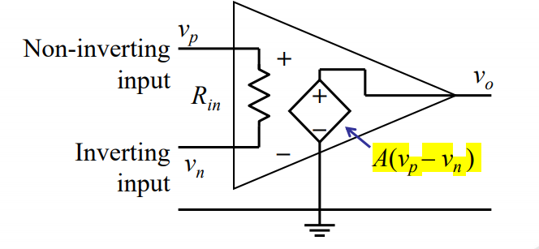

# Operational Amplifiers

  

- Vcc is external voltage sources required to activate the internal components of the opamp and to set the limits of the output voltage.

## Internal represention
  

In ideal cases: 
- The input resistance is infinite.
- The output resistance is zero.
- The gain is infinite.
- The op amp is in a negative feedback configuration

## To Solve
- $V_{1} = V_{2}$
- Do nodal analysis at both ends.
- Never do a nodal at $V_{o}$