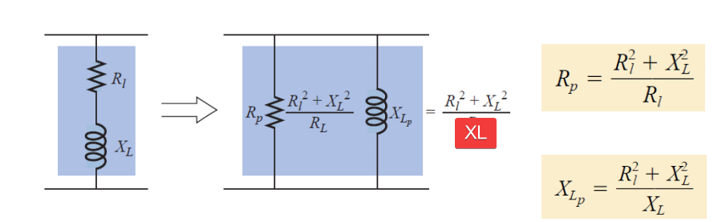

# Resonance
It's a condition in an RLC circuit in which the capacitive and inductive reactences are equal in magnitude, thereby resulting in a purely resistive impedance.

$$ \omega_0 = \frac{1}{\sqrt{LC}} $$

> The above equation applies to both series and parallel circuits.
- The impedance is purely resistive, thus, $Z = R$ In other words, the LC series combination acts like a short circuit, and the entire voltage is across R.
- The voltage Vs and the current I are in phase, so that the power factor is unity.

## Series Resonance
The current is equal to the voltage divided by the impedence. The maximum current is acheived when the impedences cancel out and the current is $V_m / R$.

Half power point is the point at which the current is equal to $\frac{1}{\sqrt{2}}$ it's max value. There's two such points called $\omega_1$ and $\omega_2$

### Bandwidth
$$ \text{BW} = \omega_2 - \omega_1 $$

### Half power points
$$ P = \frac{1}{2} I^2 R $$

$$ P(\omega_0) = \frac{1}{2} \frac{V_m^2}{R} $$

$$ P(\omega_1) = P(\omega_2) = \frac{V_m^2}{4R} $$

To get the half power frequencies one can use the following formula: 
$$ \omega_{1,2} = \plusmn \frac{R}{2L} + \sqrt{\frac{R}{2L}^2 + \frac{1}{LC}} $$

#### Relation between the two frequencies
$$ \omega_0 = \sqrt{\omega_1 \omega_2} $$
$$ \text{BW} = \omega_2 - \omega_1 = \frac{R}{L} $$

### Quality Factor
It's the ratio of the resonant frequency to its bandwidth.

$$ Q = \frac{\omega_0}{\text{BW}} = \frac{\omega_0 L}{R} $$

#### Using quality factor to calculate the half power freq's
$$ \omega_{1,2} = \omega_0 \left[ \frac{ \plusmn 1}{2Q} + \sqrt{ \left( \frac{1}{2Q} \right)^2 + 1 } \right] $$

If $Q > 20$, one can approximate them using the following rule: 
$$ \omega_{1,2} = \omega_0 \plusmn \frac{\text{BW}}{2} $$

## Parallel Resonance
There's a duality relationship between parallel and series resonance where rules are exact same with the following changes
$$ I \rightarrow V $$
$$ R \rightarrow \frac{1}{R} $$
$$ L \rightarrow C $$

### Conversion between series to parallel branches
   