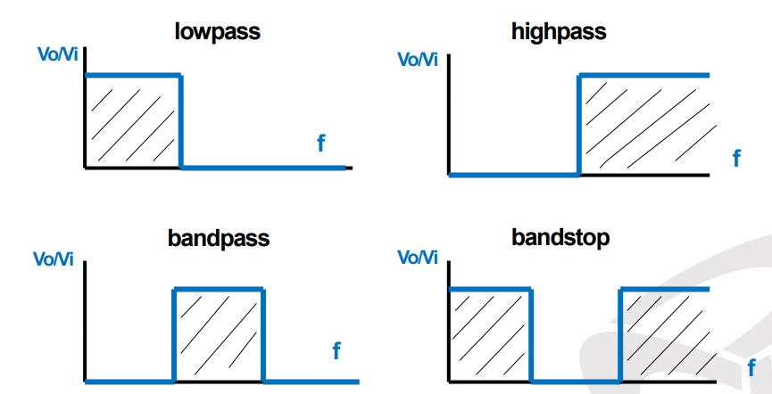
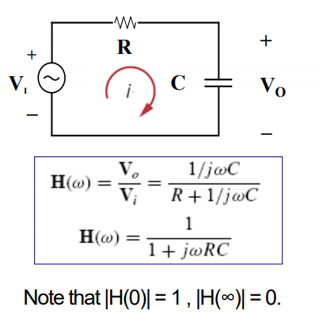

# Filters
A filter is a circuit that allows the passing of signals with desired frequencies while blocking others.

## Passive Filters
- The maximum gain of a passive filter is unity
- To generate a gain greater than unity, one should use an active filter.

  

### Low pass filter
It allows low freqs to pass but blocks high freqs.

  

The half-power frequency *(aka cutoff frequency)* is obtained by setting the magnitude of $H(\omega)$ to $\frac{1}{\sqrt{2}}$

> The cutoff frequency is the frequency at which the transfer function H drops in magnitude to 70.71% of its maximum value.

$$ \omega_c  = \frac{1}{RC}$$

### High pass filter
It's similar to the low pass filter.

### Band pass filter
It passes all frequencies in a range and blocks the outer range.

$$ \omega_1 < \omega < \omega_2 $$

The bandpass filter will have two corner frequencies $\omega_1$ and $\omega_2$.

The circuit is in resonance at $\omega_0$ which is the center of $\omega_1$ and $\omega_2$. Normal resonance rules apply.

### Band stop filter
Exact opposite to band pass filter but similar in rules. Zero voltage passes at resonance frequency.

## Active Filters
They often have opamps. To solve this problems, solve it like any normal opamp problem and then obtain $H(\omega) = V_o/V_i$. Analyze it to get filter type and cutoff frequency.

#### First order low pass filter
$$ \omega_c = \frac{1}{R_f C_f} $$

#### First order high pass filter
$$ \omega_c = \frac{1}{R_i C_i} $$