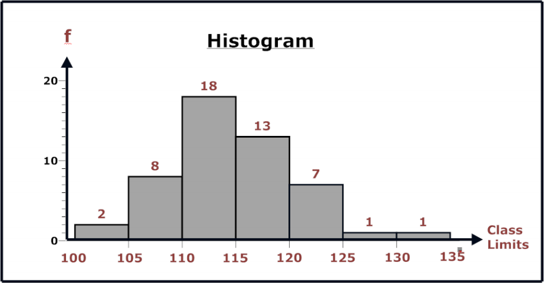
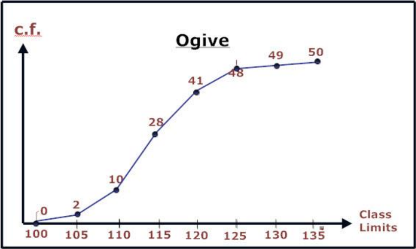
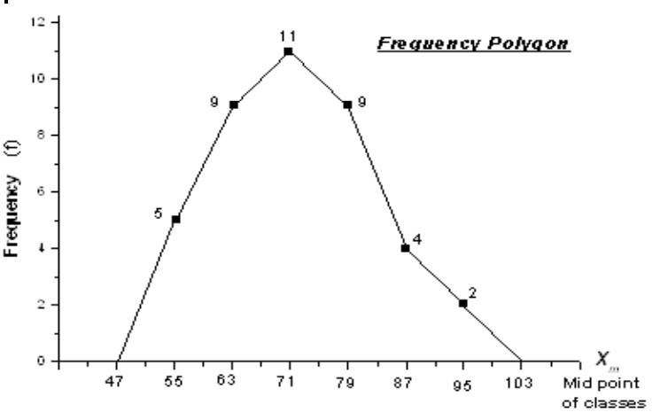
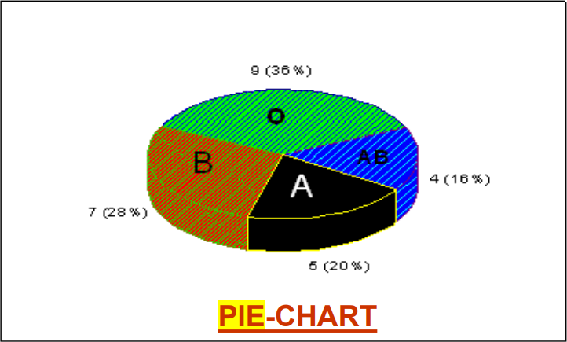

# What is Statistics ?
In short, it's used to make more effective decisions.
- Collect data
- Organise Data
- Present Data
- Analyze Data
- Draw Conclusions

# Types of Data
## Qualitative
When data is non numeric like blood type or grade letter.

## Quantitative
When data is represented as numbers.

We're mostly concerned about this type throughout the course. Quantitve data assumes numeric values to be: 
- **Discrete**: when they're finite or countable. Sum is denoted by $\sum$
- **Continuous**: when data is uncountable and has infinitely many values. Sum is denoted by $\int$

# Types of Statistical Studies
## Descriptive Statistics
Consists of **collecting**, **organizing**, **presenting** and **summarizing** of data in informative way.

The target is to ***describe*** a certain situation represented by a data set.

## Inferential Statistics
Involves drawing conclusions and making decisions depending on data from descriptive stats.

The target is to make ***inferences*** about a certain situation represented by a data set.

# Populations vs Samples
## Population
- Population is the COMPLETE set of individuals/elements.
- Population is normally too large to be fully examined.

## Samples
- One takes a sub-group of a population to study.
- A major problem is to make sure a selected sample is **representative** of the complete population.
  
So the major task of inferential statistics is to make conclusions about a whole population based on a sample!

# Descriptive Statistics Steps

## Step 1: Organization
We organize data into a **Frequency Distribution** which is a table consisting of 3 columns: 
- Class Limits with a row for each class
- Class Frequency which is the number of occurrances in this class.
- Relative Frequency which is equal to the frequency divided by the total number of values.

### Categorical Frequency Distribution
Used for qualitative and small quantitative data sets.

1) Construct a table with a row for each class.
2) Count the number of occurances of each class and place the results in the second column.
3) Fill the 3rd column, relative frequency.
4) Sum of relative frequencies must be one!

### Grouped F.D.
Used for large quantitative data sets.

1) Find the range of the data. $range = high - low$
2) Increase range by 1 and divide the number of classes. **Round up if result is non-integer.**
3) Create class limits following the range calculated above.
4) Fill in the table keeping in mind the **left-end inclusive convention**.
5) Compute the values of the relative frequencies.
6) Sum of relative frequencies must be one!

> Left-end inclusive convention states that we assume that all ranges are of from $[s, e)$ where the starting point is included but not the end.

### Important Notes: 
- Classes must be of equal width.
- Classes must be mutually exclusive, exhaustive and continous.
- Number of classes must be sufficient for a clear description of the data. Some books say from 5 to 20.

## Step 2: Data Presentation
Data is represented by different types of graphs!

The following are used to present quantitative data.

### Histograms
- Each bar represents a class or a class limit.
- The height of a bar represents the frequency of a class.
- Histograms provide a quick picture of the main characteristic of the data.

### Ogives
- Displayes data by using lines connecting points.
- The x-coordinate of a point represents the **upper** class limit.
- The y-coordinate represents the class **cumulative frequency**.
- Ogives are useful for determining the number of values below a value.

- **Upper class limit** is the bigger value of the range.

- **Cumulative frequency** is the frequency of the current class and the sum of all previous classes.

> ### Relative Frequency
> Useful when comparing different data sets. Using frequencies will be misleading.
> - Histograms could be done using relative frequency on the y-axis.
> - Ogives could be done using cumulative relative frequencies on y-axis

### Frequency Polygons
- Find the midpoint of each class.
- Draw histogram with midpoints on x-axis and frequencies on y-axis.
- Connect points with straight lines.
- Draw a line to x-axis to the points of equal distances to the prev and next midpoints.

### Pie Charts
Used to represent qualitative data!

## Step 3: Summarization

Data summarization involves extracting information about the general distribution of data.

### Central Tendency
We're interested in a value that represents the *center* of the distribution!

We'll study three definations under Central Tendency: 

#### The median (MD)
It's the midpoint of the entire data array.
To determine the midpoint we follow the following steps: 
- Sort the data values.
- Pick the value in the middle.
  - If the number of elements is odd then the midpoint is the obvious midpoint.
  - If the number of elements is even, then the midpoint is equal to sum of both middle points divided by 2!

> **NOTE**: Median doesn't need to be a data value!

- The median considers only the **number of elements** in the data set that are less or more than the median, ignoring their values or frequencies.
- **Qualtitative distributions dont have a median!**

#### The mode
It's the data value that has the highest frequency in a data set.
- A distribution may have one, more than one or no mode at all.
- Exists for both qualitative and quantitative data.
- Sort the values then identify the value with the highest frequency.
- The intuition is that the value with most frequency is the most typical in the population.