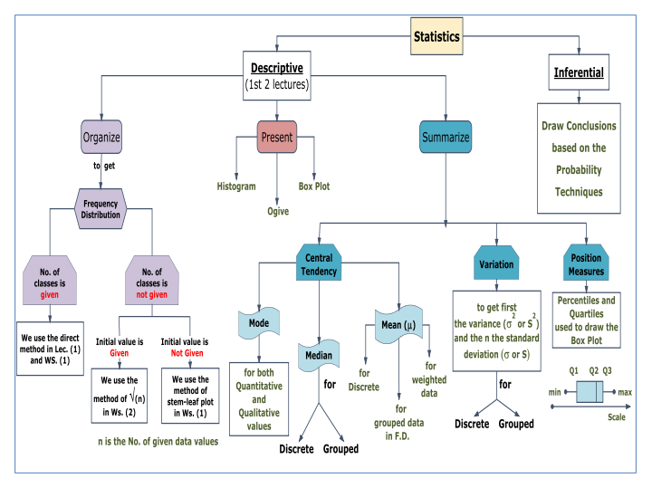

# Measures of Central Tendency

## Modal Class
It's the class with the highest frequency.

## Estimating Median
$$ Md = \frac{\frac{n}{2} - prefix \; c.f}{f} * w + L_m $$

## Mean
- Mean for a full population is called $\Mu = \frac{\sum x}{N}$.
- For a sample of size n, the mean is called $\bar{X} = \frac{\sum x}{N}$

> Mean is rounded to one more decimal place.

### Weighted Mean
$$ \Mu = \frac{\sum W_i X_i}{\sum W_i} $$

### Estimating Mean: 
- Find class midpoints. $X_m$
- Multiply each midpoint by it's frequency $f$.
- Sum the products $f.X_m$
- Divide by the sum of frequencies.

$$ \Mu = \frac{\sum f \cdot X_m}{N} $$

## Standard Deviation
It's the square ROOT of the **Variance**.
- For a population: $\sigma = \sqrt{\sigma ^ 2}$
- For a sample: $s = \sqrt{s^2}$

### Population Variance
$$ \sigma ^ 2 = \frac{\displaystyle \sum_{i=1}^N (X_i - \Mu)^2}{N} $$
- The variance is just a **MEAN** value.
- It's the mean of the square distances to the population mean.
> Squaring is required to get rid of negative distances.

### Sample Variance
$$ S ^ 2 = \frac{\displaystyle\sum_{i=1}^n (X_i - \bar{X})^2}{n-1} $$

> **NOTICE**: We divide by $\bold{n-1}$ and not N!

#### Shortcut formula: 
$$ S^2 = \frac{\displaystyle
    \sum_{i=1}^n X_i^2 -
    \frac{\displaystyle
        \left( \sum_{i=1}^n X_i \right)^2
    }{n}
}{n-1} $$

### Steps to calculate standard deviation
- Find the sum of the values $\sum X_i$
- Square each value and sum them $\sum X_i^2$
- Substitute into the **shortcut** formula.
- Compute square root.

## Variance for Grouped data
### For a population
$$
    \sigma^2 = \frac{\displaystyle
        \sum f.(X_m - \Mu)^2
    }{
        \sum f
    }
$$

### For a sample: 
$$ S^2 = \frac{\displaystyle
    \sum f . X_m^2 - \frac{\displaystyle
            (\sum f . X_m )^2
        }{
            \sum f
        }
    }{
        (\sum f ) -1
    }
$$

# Chebyshev’s Theorem
Specifies the portions of the spread in terms of the S.D

The proportion of values from a data set will fall within $k$ standard deviations of the mean $\bar{X}$ lying in the interval $[X-ks, X+ks]$ will be at least $1 - \frac{\displaystyle 1}{\displaystyle k^2}$

> $k$ must be greater than 1.

# Percentiles
Used to locate the relative position of a data value in a set.
To calculate the value, we: 
- Sort the data values first.
- $$ Percentile = \frac{0.5 + No. \; of \; values}{n} * 100$$

### How to reverse the above operation ?
- Sort the data.
- We calculate the position as $m = n.\frac{p}{100}$
  - If $m$ is not integer, we round it up to the higher integer.
  - If $m$ is an integer, then the value is the average of position $m$ and $m+1$.

# Quartiles
Quartiles simply split the data into 4 equal parts splitting at $Q1$, $Q2$ and $Q3$!

> The second quartile is simply the median!

# Box Plots
  

# Data Set Types
- **Normal**: If its Histogram is bell-shaped with peak at exact median.
- **Approx. Normal**: If its Histogram is approximately a normal one.
- **Skewed**: not approximately symmetric about its sample median.

# Summing up Lec1 and Lec2
  
