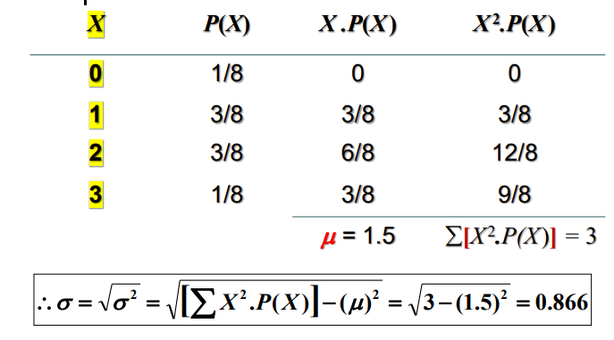
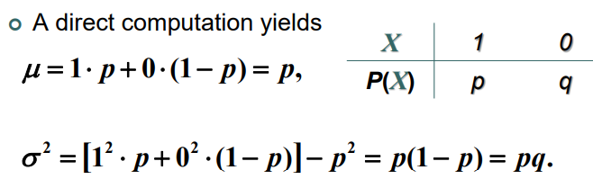

# Probability Distribution
It's like frequency distribution but instead of frequencies, it's probabilities. And instead of classes, it's $X$ which is the possible outcomes of a situation.

- The random variable $X$ can either be countable or not.
- The sum of all probabilities must be exactly $1$ in any probability distribution. Example:   

## Bernoulli Experiments
A Bernoulli trial is an experiment with ONLY TWO
outcomes.

$P(S) = p = \text{proabability of success}$
$P(F) = q = (1-p) = \text{proabability of failure}$

# Binomial Distribution
- A bionomial experiment consists of a fixed number of independent trials of a Bernoulli experiment.
- The random variable $X$ represents the number of successes in $n$ trials.

$$ P(k) = nC_k \cdot p^k \cdot (1-p)^{n-k}$$

## Conditions for the bionomial distribution
- The procedure has a **fixed** number of trials.
- The trials must be **independent**, meaning that the outcome of one trial does not affect the outcome of any other trials.
- Each trial must have all outcomes classified into **two mutually exclusive** categories: a success or a failure.
- The random variable counts the number of successes in the fixed number of trials.
- The probability of success “or fail” remains the same in all trials.

# Geometric Distribution
An experiment consists of repeating independent Bernoulli trials, until the first success.

$$ P(k) = p\cdot(1-p)^{k-1} $$

> Remember the geometric series sum: 
> $$\sum_{k=0}^\infty (1-p)^k = \frac{1}{1 - (1 - p)} = \frac{1}{p}$$

- The Probability that the 5th bit is received in error is $p\cdot q^4$.
- The probability that the 5th bit is received in error given that the first 4 bits are okay is just $q$. This happens because conditional probability implies that the condition event already happend and doesn't need to be included in the calculated probability.

## Lack of memory property
Memoryless systems are a system where the probability of an event occuring at time $k$ is the same across all possible times.

For example, in the transmission of bits, if 100 bits are transmitted, the probability that the first error, after bit 100, occurs on bit 106 is identical to the probability that the initial error occurs on bit 6.

# Negative Binomial Distribution
Let $X$ stand for the number of bits received until $r$ bits are received in error, with the probability of a single bit in error being $p$.

$$ P(k) = (k-1)C_{r-1} \cdot p^r \cdot (1-p)^{k-r}$$

> Notice that when $r=1$, the negative binomial dist. is a geometric R.V.
>
> **THUS**, negative binomial distribution is just a generlization of the geometric distribution. ***A negative binomial random variable $X$ can be interpreted as the sum of $r$ geometric random variables.***

# Probability Mass Function
It's the probability at a certain value $x$ where it's defined as: 

$$ f(x_k) = P(X = x_k) = p_k $$

Sum of $f(x_k)$ is one.

# Cumulative Probability Function
It's similar to the PMF but it instead sums up values upto $x_k$

$$ F(x) = P(X <= x) = \sum_{x_k <= x} f(x_k) $$

Where $f$ is the probability mass function.

# Expected Value
The expected value of a discrete random variable is given by: 

$$ \mu = E(X) = \sum X * Ps(x) = \sum_k x_k p_k$$

## Example
  
  

# Expectation and Variance of Bernoulli Random Variable
  

## For binomial random variable: 

$$ \mu = np $$
$$ \sigma ^2 = np(1-p) = npq $$

## For geometric RV: 
$$ \mu = \frac{1}{p} $$
$$ \sigma^2 = \frac{1-p}{p^2} = \frac{q}{p^2} $$

