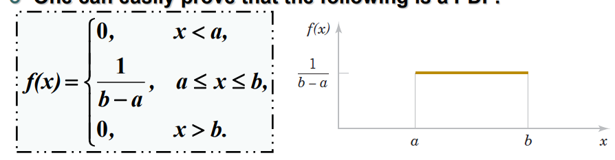

# Poisson Distribution

It's exactly the same as a normal bionomial distribution except it's more effecient when it comes to calculating for large $n$ and small $p$.

$$ P(k) = \frac{e^{-\lambda} \cdot \lambda ^ k}{k!} $$

Where $\lambda =np$

## Notes
- Probability of more than 1 count in one sub-interval is $0$.
- The probability of 1 count in a sub-interval is the same for all sub-intervals, and propotional to the length of the sub-interval.
- The count in each sub-interval is independent of counts in other sub-intervals.
- Poisson distr. gets the probability from the number of events per period. You can solve the same problem using bionomial dist. by dividing the period into very small points where each point can either be $p$ or $q$.
- Poisson distribution can only be used as an approximation to a bionomial distribution when $n \geq 100$ and $n \cdot p \leq 10$

## Expected value and Variance
If $\lambda > 0$ then: 

$$ \mu = E(N_\lambda) = \lambda$$
$$ \sigma ^2 = V(N_\lambda) = \lambda $$

# Continuous Probability Distributions
## Probability Density Function (PDF)
It's the same as the Probability Mass Function in discrete numbers.
- The total area (sum) under the curve is one.
- Every point on the curve has value 0 or greater.

## Cumulative Probability Function
It's the sum of all probablities less than $x$. However in continoius domain, sum $\rightarrow$ integration.

$$ F(x) = P(X \leq x) = \int_{-\infty}^x f(u) du  = F^{\prime}(x) = f(x)$$

### Notes between Discrete And Continious: 

- The derivative of CPF $F(x)$ is PDF $f(x)$
> **NOTE:**  To get probability of a range: 
> $P(a \leq X \leq B) = \int_a^b f(x) dx = F(b) - F(a)$
- The probability of a single value will equal **_zero_**.

In continuous time: 
$$P(a \leq X \leq b) = P(a \lt X \lt b) = P(a \leq X \lt b) = \int_a^b f(x)dx$$

However, in discrete time: 
- $P(1 \leq X \leq 3) = P(1) + P(2) + P(3)$
- $P(1 \lt X \lt 3) = P(2)$
- $P(X = k) = \text{some value}$

## Expectation and Variance of Cont. Distribution
We just replace each $\sum$ with $\int$

$$ \mu = E(x) = \int_{-\infty}^{\infty} x \cdot f(x) dx $$
$$ \sigma^2 = \left[ \int_{-\infty}^{\infty} x^2 \cdot f(x) dx \right] - \mu^2 $$

# Uniform Distribution
  
- The probability of any interval is dependent only on it's length.

# Exponential Distribution
$$ 
    f(t) = 
    \left\{
        \begin{array}{ll}
            0  & \text{if } t \leq 0 \\
		    \lambda e^{-\lambda t} & \text{if } t > 0
        \end{array}
    \right.
$$

The CPF for the above PDF is: 

$$ F(t) = P(L \leq t) = 
\left\{
        \begin{array}{ll}
            0  & \text{if } t \leq 0 \\
		    1 - e^{-\lambda t} & \text{if } t > 0
        \end{array}
    \right.
 $$

## Expected Value and Variance
### In Exponential Dist :
$$ \mu = \frac{1}{\lambda} $$
$$ \sigma^2 = \frac{1}{\lambda^2} $$

### In Uniform Dist :
$$ E(X) = \frac{a+b}{2} $$
$$ V(X) = \frac{(b-a)^2}{12} $$

# Moment Generating Function
$$ M_x = E(e^{tX}) = \int_{-\infty}^{\infty} e^{tx} \cdot f(x) dx $$

# But what's the exponential distribution ?
It's the inverse of the Possion distribution where we are answering the time/distance between the events.

$$ F(x) = P(X \leq x) = 1 - P(X \gt x) = 1 - e^{-\lambda x} $$

$$ f(x) = F^\prime x = \lambda e ^{-\lambda x} $$

> Remeber that $\lambda$ is the number of events **per unit time/distance**

## Properties
- $$ P(s \leq L \leq t) = \int_s^t f(u)du = F(t) - F(s) $$
- $$ P(L = t) = 0 $$
- $$ P(a \leq X \leq b) = P(a \lt X \lt b) = P(a \leq X \lt b) $$

## Lack of Memory
Exponential distribution is the only continuous distribution with this property “Lack-of-Memory”. The probability of an event happening in X seconds is the same no matter the starting point.